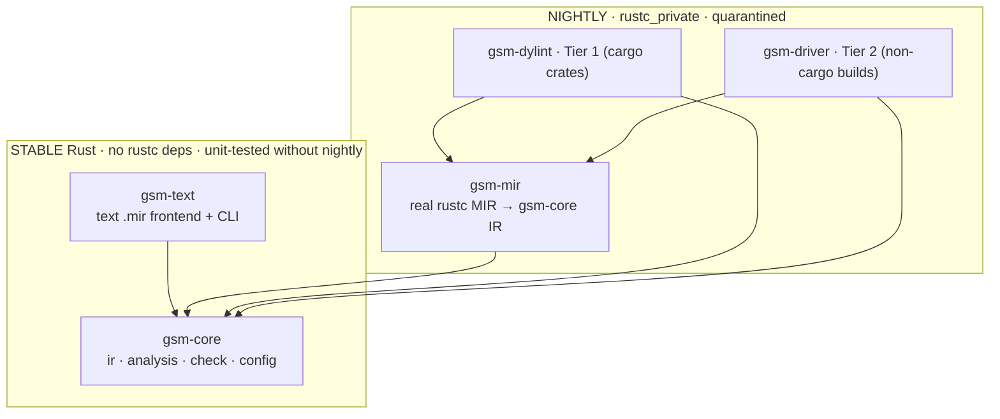
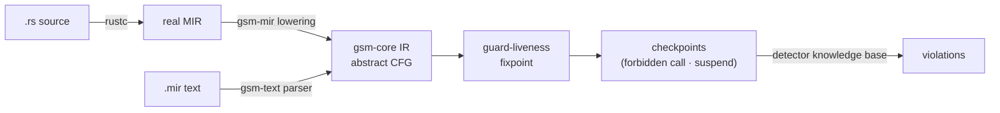
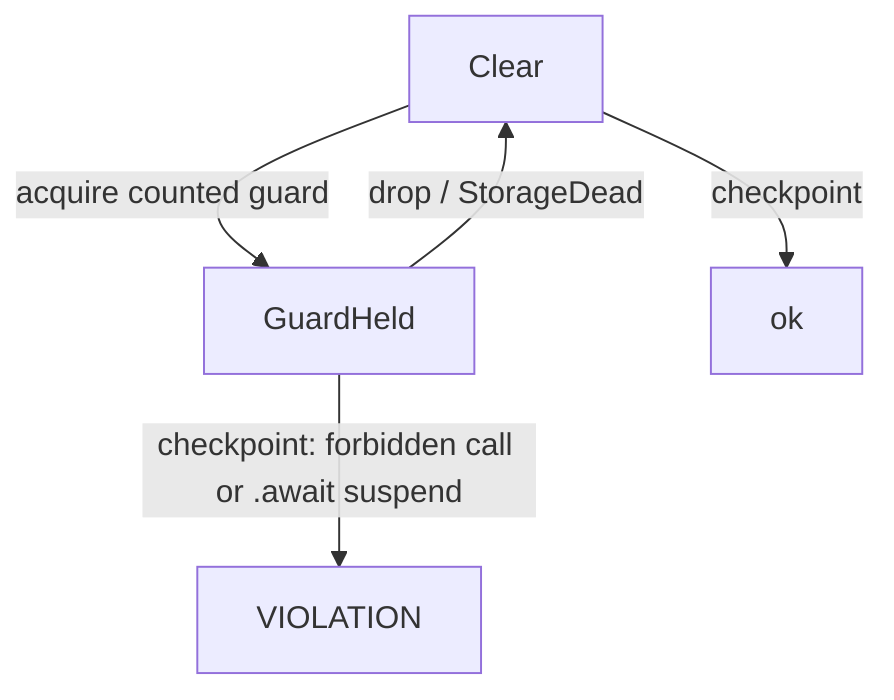

<!--
SPDX-License-Identifier: GPL-2.0
Author: Annanya Sood <annanyas0142@gmail.com>
-->

# guardstate-mir — Design Document

**A MIR-level critical-section typestate analyzer for Rust.**

**Author:** Annanya Sood &lt;annanyas0142@gmail.com&gt;
**Name:** `guardstate-mir` — the real-MIR generalization of
[`guardstate`](https://github.com/AnnanyaSood1/guardstate); the name makes the
lineage explicit.
**Relationship:** `guardstate`'s proven lattice becomes this project's `core` crate.
**Status:** design.

---

## 0. What this document is

`guardstate` proved a typestate lattice on a *hand-written, MIR-shaped* text
format. Its honest weakness: it does not read real `rustc` MIR, so the hardest
and most demonstrative skill — the front-end that ingests post-drop-elaboration
MIR — was deferred. `guardstate-mir` closes exactly that gap.

`guardstate-mir` is deliberately **not** a reproduction of the full CLSC research
system (no C-side LLVM pass, no kernel build, no cross-language FFI join). It is a
**self-contained variation** whose purpose is to demonstrate, end to end, the
capability the research depends on: *reading real Rust MIR and running a sound
typestate analysis over it.* CLSC's sleep-in-atomic detector is then recovered as
**one configuration** of the engine `guardstate-mir` provides.

---

## Table of contents

0. [Visual overview](#visual-overview)
1. [Motivation and framing](#1-motivation-and-framing)
2. [The core idea: guards, checkpoints, and the liveness check](#2-the-core-idea-guards-checkpoints-and-the-liveness-check)
3. [Showcase detectors (instantiations)](#3-showcase-detectors-instantiations)
4. [Goals and non-goals](#4-goals-and-non-goals)
5. [Architecture and the quarantine principle](#5-architecture-and-the-quarantine-principle)
6. [The abstract CFG (core IR)](#6-the-abstract-cfg-core-ir)
7. [The MIR lowering layer (the hard part)](#7-the-mir-lowering-layer-the-hard-part)
8. [Frontends and invocation modes](#8-frontends-and-invocation-modes)
9. [Configuration and the knowledge base](#9-configuration-and-the-knowledge-base)
10. [Soundness and precision](#10-soundness-and-precision)
11. [Testing strategy](#11-testing-strategy)
12. [Risks and mitigations](#12-risks-and-mitigations)
13. [Phasing (Tier 1 → Tier 2)](#13-phasing-tier-1--tier-2)
14. [Relationship to the CLSC research](#14-relationship-to-the-clsc-research)
15. [References](#15-references)
16. [Author's note on AI assistance](#16-authors-note-on-ai-assistance)

---

## Visual overview

**Crate architecture and the quarantine boundary** — stable core, fragile rustc
code isolated in `gsm-mir`:



**Analysis pipeline** — both frontends lower into one abstract CFG; the analysis
and checker are shared:



**The checkpoint rule** — the unifying idea (guard-live ∧ at-a-checkpoint ⇒
violation):



## 1. Motivation and framing

Many of the costliest Rust concurrency defects share one shape: a value
establishes a **restricted context** (a lock guard, a preemption-disabled
section, an RCU read-side), and some operation is illegal while that context is
live. Two well-known instances:

- **Holding a lock guard across an `.await`** — a std/async footgun serious
  enough that Clippy ships `await_holding_lock`; it can deadlock an executor.
- **Sleeping in atomic context** — the kernel invariant at the heart of the CLSC
  research: a spinlock guard is live and a may-block operation is invoked.

These are the *same* property at different instantiations: *no forbidden
operation while a guard of a given class is live.* `guardstate-mir` implements
that property once, over real MIR, and configures the two sets (which types are
guards; which operations are forbidden) per detector. Building the general engine
is a stronger demonstration than any single detector, and it directly de-risks
the O1→P2 step of the research.

---

## 2. The core idea: guards, checkpoints, and the liveness check

Three primitives, and one uniform check:

- **Guard** — a value whose *type* marks it as establishing a restricted context
  (e.g. `std::sync::MutexGuard`, an RfL `Guard<_, SpinLockBackend>`). A guard is
  *live* from its acquiring call until its drop / `StorageDead`.
- **Checkpoint** — a program point at which the restriction is tested. Two kinds:
  a **call** to a *forbidden operation* (a configured callee), and a **suspend
  point** (an `.await`, which after coroutine lowering corresponds to a `Yield` /
  saved-state boundary — see §7.3 for the important subtlety).
- **The check** — at every checkpoint, if a guard of the detector's class is
  live, report a violation.

This unifies `guardstate`'s "call-site join" and async's "await-holding-lock"
into a single rule: *guard-live ∧ at-a-checkpoint ⇒ violation.* The typestate
lattice that computes guard-liveness is exactly the one already proven in
`guardstate`; `guardstate-mir` feeds it real MIR and evaluates the check at call
checkpoints (straightforward) and suspend checkpoints (which require
coroutine-layout reasoning, not a plain-CFG query).

**Lattice (unchanged from guardstate).** Two points, `Clear ⊑ GuardHeld`; the
abstract state is the set of live guard locals; join is union at merges;
`try_lock`-style conditional acquisition is path-sensitive; `mem::forget` keeps
the guard held (conservative); drops are keyed on the elaborated drop point.

---

## 3. Showcase detectors (instantiations)

Two detectors, one central and one stretch. (The engine trivially supports other
checkpoint shapes; see the D-DOUBLE footnote.)

- **D-BLOCK — blocking/forbidden call in a critical section.** *Simplest to
  build and the strategically central detector*: it is the honest pure-std-Rust
  analogue of sleep-in-atomic, so it is the one that directly discharges the
  "doesn't read real MIR" criticism. Guard class: any lock guard. Forbidden ops:
  a configured set of blocking calls (`std::thread::sleep`, blocking `std::io`
  reads, channel `recv`, etc.). *Needs only call checkpoints* — no coroutine
  reasoning. **First and primary detector.**

- **D-AWAIT — lock guard held across an `.await`.** The impressive result that
  demonstrates async-MIR mastery. Guard class: any lock guard. Checkpoint: an
  await suspend point. Validated as a real bug class by Clippy's
  `await_holding_lock`; our version is a *dataflow/MIR* analysis rather than a
  syntactic HIR lint. **Attempted as a stretch goal; success reported honestly
  either way** (see §7.3 and §13) — it is not promised as a guaranteed Tier-1
  deliverable, because coroutine-layout analysis is materially harder than call
  checkpoints.

> **D-DOUBLE (cut).** An earlier draft proposed a third detector — "second lock
> acquired while one is held." It is dropped: as stated it is either trivially
> true (it fires on every safe nested-locking pattern) or it requires a full
> program-wide acquisition-order relation, which is a different research problem
> (lock-ordering analysis) and out of scope. The engine *could* host such a
> detector, but shipping it as designed would be noise. Two well-executed
> detectors beat three uneven ones.

---

## 4. Goals and non-goals

### Goals

- **G1.** Ingest **real post-drop-elaboration MIR** from `rustc` and run the
  guard-liveness lattice over it — the capability `guardstate` lacked.
- **G2.** Evaluate the checkpoint rule at call sites (G2a) and, as a stretch, at
  await suspend points (G2b).
- **G3.** Keep the fragile `rustc_private` code isolated in one small crate; keep
  the proven lattice/join stable and testable without nightly.
- **G4.** Ship **D-BLOCK** on real MIR with a committed fixture suite (§11);
  attempt D-AWAIT and report the outcome honestly.
- **G5.** Be self-contained: runs on ordinary Rust crates via `cargo dylint`, no
  kernel and no C-side dependency.

### Non-goals

- **N1.** The C-side LLVM sleepability pass and the cross-language FFI join.
  Replaced here by an internal knowledge base (§9).
- **N2.** Kernel build integration as a *requirement*. The Tier-2 driver *can* be
  pointed at a kernel later, but the variation is proven on plain crates.
- **N3.** Interprocedural summarization across the whole crate graph in v1; the
  liveness analysis is intraprocedural per body, with callee classification by
  type/def-path.
- **N4.** Lock-ordering / deadlock-order analysis (the cut D-DOUBLE).
- **N5.** A verifier-grade guarantee. Like CLSC, this is a sound *detector*.

---

## 5. Architecture and the quarantine principle

**Governing principle:** the `rustc_private`-facing code is fragile and
version-bound, so it must be *small, written once, and behind a stable boundary.*
Everything above that boundary compiles on stable Rust and is unit-tested without
nightly. (This is the same architecture `rustc`'s own tooling — Clippy, `dylint` —
uses, and adopting it deliberately is part of the point.)

Cargo workspace; arrows mean "depends on":

```
guardstate-mir/  (workspace)
├── rust-toolchain.toml               # pins the nightly for the MIR crates
├── crates/
│   ├── gsm-core/          # STABLE. no rustc deps.
│   │   ├── ir.rs          #   abstract CFG (generalized guardstate ir.rs)
│   │   ├── analysis.rs    #   guard-liveness lattice + fixpoint  (proven)
│   │   ├── check.rs       #   the checkpoint rule → violations
│   │   └── config.rs      #   detector config / knowledge base
│   ├── gsm-text/          # STABLE. text-IR frontend → core::ir (unit tests)
│   ├── gsm-mir/           # NIGHTLY (rustc_private). TyCtxt → core::ir.
│   │                      #   ALL rustc knowledge lives here. The hard crate.
│   ├── gsm-dylint/        # Tier 1 frontend: a dylint lint (cargo crates)
│   └── gsm-driver/        # Tier 2 frontend: a rustc wrapper (non-cargo builds)
└── fixtures/              # real .rs inputs for MIR integration tests
```

Only `gsm-mir`, `gsm-dylint`, `gsm-driver` need nightly. A nightly bump that
breaks `rustc_private` breaks *only* `gsm-mir`; the lattice and its golden tests
keep compiling and passing. This is the single most important design decision: it
bounds the blast radius of the fragile dependency.

---

## 6. The abstract CFG (core IR)

`guardstate`'s IR is a toy subset; `guardstate-mir` generalizes it just enough to
be a faithful lowering target for real MIR, while staying rustc-agnostic:

- `Local(u32)` indices, matching MIR.
- `Terminator` supports general **`SwitchInt`** (N targets), **`Drop`**,
  **`Call { callee, args, target }`**, **`Suspend { resume }`** (await/yield
  checkpoint), `Goto`, `Return`, `Unreachable`.
- `Callee { def_path: String, is_foreign: bool, produces_guard: Option<GuardClass>,
  is_forbidden: bool }` — the lowering resolves these so the analysis never sees a
  `rustc` type.

**Design improvement over guardstate — `TryAcquire` removed.** `guardstate` had a
bespoke `TryAcquire` node. Here conditional acquisition is *recognized during
lowering* (a guard-producing call whose result is matched by a following
`SwitchInt`) and expressed by marking which successor edge makes the guard live.
This is a genuine cleanup, not a rearrangement: it moves the cleverness into the
lowering layer where the language-specific pattern-matching belongs, and keeps the
core IR small and generic. The core's transfer functions are unchanged in spirit:
acquire inserts, drop removes, union at merges, and at any forbidden `Call` or any
`Suspend`, emit a checkpoint record carrying the current guard-held state.

---

## 7. The MIR lowering layer (the hard part)

`gsm-mir` is where the real work — and the real skill demonstration — lives. It
converts `rustc`'s MIR into `gsm-core::ir`. Four sub-problems.

### 7.1 Which MIR, and drop points

We need **drop-elaborated** MIR: explicit `Drop` terminators and `StorageDead` at
true drop points (the proposal's "ground truth for execution semantics").

**Correction to verify on day 1.** Drop elaboration is a *mandatory* MIR pass, not
an optimization, so any post-elaboration query is already drop-elaborated
regardless of opt level. Concretely: pull the body via
`mir_drops_elaborated_and_const_checked` (drop-elaborated, pre-optimization), *or*
`optimized_mir` compiled at `-Zmir-opt-level=0` — where opt-level=0 does **not**
"turn on" drop elaboration (that always runs) but **suppresses inlining and
const-propagation**, which would otherwise merge functions and break the
per-body guard-liveness model. **This exact query choice and its stability must be
verified against the pinned nightly before designing around it** (the two queries
differ in when they can be legally stolen/called, and one can panic depending on
timing). Guard release = `StorageDead(local)` or `Drop { place }` on a local
classified as a guard.

### 7.2 Guard identification — by type, not by name

**Design improvement over guardstate**, which matched acquire *names*. Real MIR
shows a `Call` whose **destination local's type** is a guard type, not a string.
The classifier inspects that `Ty`:

- resolve `Ty` → `TyKind::Adt(adt_def, substs)`; take `adt_def.did()` → def-path;
- match against the **guard knowledge base**: `std::sync::MutexGuard`,
  `RwLock{Read,Write}Guard`, `parking_lot` guards, and (for the CLSC
  configuration) RfL `Guard<_, B>` where `B` is a preemption-disabling backend;
- the *backend / type parameter* decides `GuardClass` (preemption-disabling vs.
  sleepable), so classification is robust to *how* the guard was obtained
  (`lock()`, `lock_irqsave()`, a helper wrapper).

Matching on type structure rather than call spelling is the maturity gain: it
survives renames and wrapper indirection that a name table would miss.

### 7.3 Checkpoint recognition

- **Forbidden calls (D-BLOCK).** Resolve the `Call` `func` operand — a
  `FnDef(def_id, substs)` — to a def-path via `def_path_str`, mark `is_foreign`
  via `is_foreign_item`, and test membership in the detector's forbidden set.
  This is a plain-CFG operation and is the primary, low-risk path.

- **Suspend points (D-AWAIT) — harder than a plain-CFG `Yield` scan.** After
  coroutine lowering, an `async fn` becomes a **state machine**, not the original
  CFG with `Yield` terminators sprinkled through it. Crucially, a local that is
  *live across an await in source terms* is promoted into the coroutine's **saved
  state** (a field of the coroutine struct), and is no longer a plain MIR local at
  the suspend point. So "is a guard live at this await?" is **not** an ordinary
  liveness query over locals; it requires inspecting the coroutine's **saved-local
  set / layout** at each suspend point and testing whether any saved local has a
  guard type — which is essentially how Clippy's `await_holding_lock` operates
  (via the coroutine `Ty` / saved locals), not by walking terminators. This is
  doable, but it is materially more work than §7.3's call path, and it is the
  reason D-AWAIT is scoped as "attempted, reported honestly" rather than promised
  (§3, §13).

### 7.4 Call resolution and conditional acquisition

Map each `Call` callee to a stable def-path; recognize `try_lock`-style acquires
(guard-producing call returning `Option`/`Result`, followed by a `SwitchInt` on
the discriminant) and mark the success edge as guard-live, the failure edge as
clear — the path-sensitivity `guardstate` already models, now driven by real
terminators.

> All `rustc` query/method names above (`mir_drops_elaborated_and_const_checked`,
> `optimized_mir`, `mir_keys`, `is_foreign_item`, `def_path_str`, `type_of`,
> coroutine saved-local/layout access) are approximately correct but **must be
> verified against the pinned nightly** — `rustc_private` is unstable and drifts
> between releases (see §12).

---

## 8. Frontends and invocation modes

Two thin shells over the same `gsm-mir` + `gsm-core`:

- **Tier 1 — `gsm-dylint` (a `dylint` lint).** Runs via `cargo dylint` on
  ordinary Cargo crates. `dylint` absorbs most of the driver/toolchain plumbing;
  a `LateLintPass` gets `cx.tcx`, from which we drive lowering + analysis. This is
  how the "reads real MIR" claim is demonstrated, on plain `.rs` fixtures — **no
  kernel required.**

- **Tier 2 — `gsm-driver` (a `rustc` wrapper binary).** For builds that are not
  Cargo projects: the build's `RUSTC` is pointed at this wrapper, which forwards to
  the real compile *and* runs the analysis on the same `TyCtxt`. This is the only
  clean hook for a `make`-driven build (and is the seam through which the kernel
  could be analyzed later, though Tier 2 is proven here on a larger standalone
  crate).

Because both call the identical lowering + analysis, the fragile code is written
exactly once and both tiers benefit from every fix.

---

## 9. Configuration and the knowledge base

Replacing CLSC's external C-side summary, `guardstate-mir` carries an internal
knowledge base per detector:

- **guard set** — def-paths of guard types and, where relevant, the type
  parameter that decides `GuardClass`;
- **forbidden set** — def-paths (and/or `is_foreign` predicate) of forbidden
  operations, or the suspend checkpoint for D-AWAIT.

**Entries need more than a def-path.** Acquisition recognition must know each
acquiring method's **return shape** — some `lock()`-family methods return a bare
`Guard`, others return `Result<Guard, _>` or `Option<Guard>` — so the lowering can
identify the guard local *without* walking backward from the caller and can attach
the `try_lock` success/fail split correctly. So a knowledge-base entry carries at
least `{ def_path, return_shape: Bare | Result | Option, guard_class }`. Deciding
these shapes for the std and RfL lock families is a P1a design task, not an
afterthought.

**Decision:** hard-code these tables in `config.rs` for v1 (simple, fast,
auditable), with a `guardstate-mir.toml` override planned so new detectors need no
recompile. This dissolves the cross-language symbol-contract risk that the real
CLSC join carries, while preserving the "check against a knowledge base"
structure — so the design still mirrors the research, just self-contained.

---

## 10. Soundness and precision

**Soundness (detector).** Guard-liveness over-approximates: union at merges never
drops a guard held on some path, `mem::forget` keeps the guard, drops are exact on
elaborated MIR, and conditional acquisition is split path-sensitively. Hence at
any checkpoint a genuinely-live guard is reflected; no violation on the modelled
fragment is missed. Claimed only intraprocedurally over the analyzed bodies and
the resolved-call set. (For D-AWAIT, "the analyzed body" includes the coroutine's
saved-local set at suspend points, per §7.3.)

**Precision.** False positives are the real engineering cost. Controlled by:
classifying guards by type (so non-guard values never raise state), the `try_lock`
success/fail split, exact drop points, and — as a named future control —
recognizing in-band gating. No opaque/learned filtering; every suppression is
deterministic and traceable.

---

## 11. Testing strategy

Two layers, matching the crate split:

- **Core unit tests (stable, no nightly)** via `gsm-text`: the seven `guardstate`
  golden cases carry over and keep proving the lattice in isolation, fast and
  toolchain-independent.
- **MIR integration tests (nightly)**: `ui_test`/`compiletest`-style **real `.rs`
  fixtures** compiled under the pinned nightly, output diffed against expected.

**Committed fixture target: at least 10 fixtures.** Minimum composition: the
**seven** original `guardstate` shapes ported to real Rust (spinlock+sleeper,
`try_lock` success/fail, early drop, sleepable-guard, non-forbidden callee,
`mem::forget`, early-return `?`), plus **at least three** async-specific shapes for
D-AWAIT (guard held across a single `.await`; guard dropped before the `.await`
[negative]; guard in one branch only across an `.await`). Stating the number is
also the build finish line. If D-AWAIT is not completed, the three async fixtures
ship as documented `known-limitation`/expected-partial cases rather than as
passing tests.

---

## 12. Risks and mitigations

- **`rustc_private` API drift (highest).** Unstable APIs change between nightlies.
  *Mitigation:* pin one nightly via `rust-toolchain.toml`; isolate all rustc use
  in `gsm-mir`; prefer `dylint`, which tracks a known-good toolchain; accept an
  occasional port on upgrade. Expect an iterative compile-fix loop. **Day-1 task:
  verify the §7.1 MIR-query choice against the pinned nightly before building on
  it.**
- **Coroutine/saved-local analysis (D-AWAIT).** Coroutine layout and saved-local
  access are the least stable, most intricate part of the API surface (§7.3).
  *Mitigation:* ship D-BLOCK first (call checkpoints only); scope D-AWAIT as
  attempt-and-report; if it does not reach end-to-end reliability, ship the
  coroutine-layout obstacle and intended solution in the roadmap rather than a
  flaky detector.
- **Guard classification completeness.** New guard types won't be recognized.
  *Mitigation:* explicit knowledge base with return-shape entries (§9); config
  override; conservative fallback for unrecognized guard-like `Deref` wrappers.
- **Call resolution gaps (indirect/dyn).** Function-pointer / trait-object calls
  aren't resolved in v1. *Mitigation:* documented scope limit (coverage, not
  soundness, on the modelled fragment); pointer analysis is future work.

---

## 13. Phasing (Tier 1 → Tier 2)

- **P0 — Workspace refactor (stable, zero risk).** Split `guardstate` into
  `gsm-core` + `gsm-text`; the seven golden tests pass from `core`. Establishes
  the stable lowering target. **Start here.**
- **P1a — `gsm-mir` + `gsm-dylint`, D-BLOCK.** Verify the §7.1 query on day 1;
  then guard-by-type, drop points, forbidden-call checkpoints, direct-call
  resolution, knowledge-base return-shape entries. Real-MIR fixtures for the
  block-in-critical-section controls pass. **This alone erases the asymmetry.**
- **P1b — D-AWAIT (attempted; success reported either way).** Coroutine
  saved-local analysis at suspend points; async fixtures. If it works end-to-end,
  it is the headline; if not, ship the documented obstacle + intended solution and
  keep the async fixtures as known-limitation cases. **Do not claim D-AWAIT in the
  README until it works end-to-end.**
- **P2a — `gsm-driver`.** rustc-wrapper; run D-BLOCK (and D-AWAIT if ready) on a
  larger standalone crate (e.g. a real async project) end to end.
- **P2b — (optional) kernel/RfL configuration.** Load the CLSC knowledge base
  (RfL guard backends, `might_sleep`/`mutex_lock` as forbidden) and point the
  driver at RfL-style code — recovering the research's Rust half as a config.

Tier 1 = P1a–P1b (dylint on fixtures). Tier 2 = P2a–P2b (driver on a real crate).
**Two-week estimate:** P0 + P1a + an honest attempt at D-AWAIT (P1b) is realistic;
D-AWAIT completing within that window is the upside, not the plan.

---

## 14. Relationship to the CLSC research

`guardstate-mir` performs the O1→P2 step the proposal promises, on real MIR, minus
the cross-language plumbing. CLSC's sleep-in-atomic detector is recovered as one
configuration (P2b) of the engine it provides.

---

## 15. References

- J. Corbet. *Preventing atomic-context violations in Rust code with klint.*
  LWN.net, 2023.
- J.-J. Bai, J. Lawall, S.-M. Hu. *Effective detection of sleep-in-atomic-context
  bugs in the Linux kernel.* ACM TOCS 36(4), 2020.
- T. Li, J.-J. Bai, Y. Sui, S.-M. Hu. *Path-sensitive and alias-aware typestate
  analysis for detecting OS bugs.* ASPLOS, 2022.
- R. E. Strom, S. Yemini. *Typestate: a programming language concept for enhancing
  software reliability.* IEEE TSE, 1986.
- The `rustc` Development Guide — MIR, drop elaboration, coroutine lowering, and
  the MIR body queries. (Verify API specifics against the pinned nightly.)
- `dylint` — writing lints that run over real crates with MIR access.
- Clippy `await_holding_lock` — prior art validating the D-AWAIT bug class and its
  coroutine saved-local approach.

---

## 16. Author's note on AI assistance

Declared before implementation, to fix intent rather than reconstruct it after:

- The **core lattice** (already proven in `guardstate`) is being ported and
  reimplemented **by hand** as a learning exercise.
- The **`rustc_private` MIR-walking code** (`gsm-mir`) is **AI-assisted for API
  discovery**, with each construct verified against `rustc` source / the dev guide
  on the pinned nightly.
- The **`dylint`/driver boilerplate** is **AI-assisted**.
- Detailed per-crate disclosure will accompany the shipped artifact.

---

*Companion to the CLSC research proposal and to the `guardstate` prototype. This
document specifies a self-contained variation intended to demonstrate real-MIR
analysis capability end to end.*
