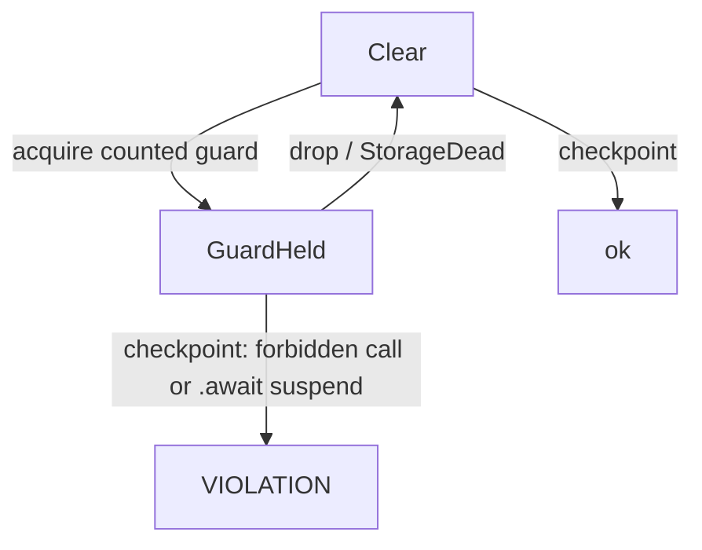
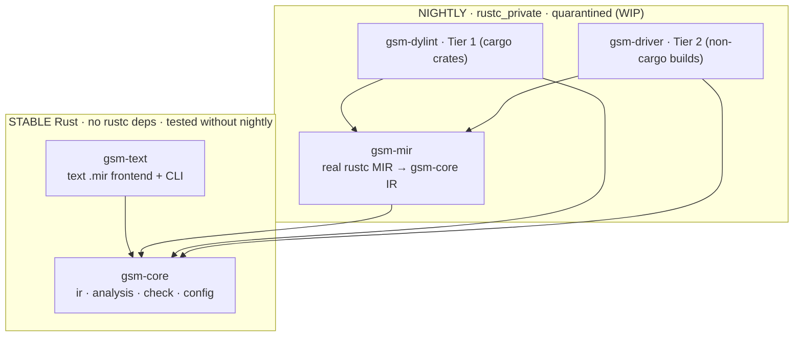
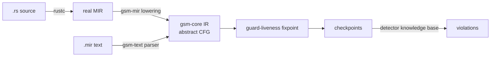

[](https://github.com/AnnanyaSood1/guardstate-mir/actions/workflows/ci.yml)

# guardstate-mir

**A MIR-level critical-section typestate analyzer for Rust — the real-`rustc`-MIR
generalization of [`guardstate`](https://github.com/AnnanyaSood1/guardstate).**

`guardstate-mir` detects a whole family of "forbidden operation while a guard is
live" defects — *blocking in a critical section*, *holding a lock across an
`.await`*, and (as a configuration) the kernel's *sleep-in-atomic* — with one
engine. A guard is any value whose **type** establishes a restricted context; a
**checkpoint** is a forbidden call or an `.await` suspend point; the rule is
uniform: **guard-live at a checkpoint ⇒ violation.**

Where `guardstate` proved the typestate lattice on a hand-written MIR-shaped
text format, `guardstate-mir` is built to run that same proven lattice over
**real `rustc` MIR** — closing the exact gap `guardstate` left open.

> **Status.** The stable core (`gsm-core`) and text frontend (`gsm-text`) are
> implemented and unit-tested against nine golden fixtures — seven ported from
> `guardstate` plus two async-shape checkpoints — which exercise the lattice
> and the checker but not real MIR ingestion. The real-MIR frontend
> (`gsm-mir`) and the Tier-1 `dylint` lint (`gsm-dylint`) are scaffolded
> against the design on a pinned nightly and are **actively in development**
> (see [`STATUS.md`](STATUS.md) and the [issue tracker](../../issues)).
> Nothing here reads real `rustc` MIR until `gsm-mir` does. Excluded from the
> stable workspace build.

---

## Table of contents

- [The idea in one picture](#the-idea-in-one-picture)
- [Architecture](#architecture)
- [What works today](#what-works-today)
- [Build and run](#build-and-run)
- [The text IR](#the-text-ir)
- [Detectors](#detectors)
- [Repository layout](#repository-layout)
- [Roadmap (Tier 1 → Tier 2)](#roadmap-tier-1--tier-2)
- [Status and honesty](#status-and-honesty)
- [Design document](#design-document)
- [Author and attribution](#author-and-attribution)

---

## The idea in one picture

The unifying rule — guard-live at a checkpoint is a violation:



Sleep-in-atomic (the research target) is just the configuration where the
counted guard class is *preemption-disabling* and the forbidden set is
*may-sleep* primitives; await-holding-lock is the configuration where the
checkpoint is a suspend point.

---

## Architecture

The design's governing principle: the fragile `rustc_private` code is **small,
written once, and quarantined** behind a stable boundary. Everything above the
line compiles on stable Rust and is unit-tested without any nightly toolchain.



Both frontends lower into one abstract CFG; the guard-liveness fixpoint and the
checker are shared:



A nightly bump that breaks `rustc_private` can only break `gsm-mir`; the proven
lattice and its tests keep compiling and passing. That blast-radius bound is
the central design decision.

---

## What works today

- **`gsm-core`** — the abstract CFG, the guard-liveness typestate lattice
  (union-at-merges may-held, path-sensitive `try_lock` via edge activation,
  conservative `mem::forget`, exact drop points), and the detector/checker.
  Improvement over `guardstate`: guards are classified by **class** and
  conditional acquisition is an **edge activation** on a general branch rather
  than a bespoke node.
- **`gsm-text`** — a text `.mir` frontend + CLI that lowers into `gsm-core` and
  runs the analysis, so the core is exercised on stable Rust.
- **Test suite** — nine text-format golden fixtures (`./run_tests.sh`): the
  seven original `guardstate` shapes plus two `suspend` (await) shapes. These
  exercise the lattice's transfer functions and the checker rule, not MIR
  ingestion — real-`.rs`-fixture tests land with `gsm-mir` (see
  [`STATUS.md`](STATUS.md)).

---

## Build and run

Requires stable Rust (1.75+) for the core and text crates. No dependencies.

```bash
cargo build                     # builds the stable crates (gsm-core, gsm-text)
./run_tests.sh                  # runs the nine text-format golden tests

# Run the analyzer on one text fixture:
./target/debug/gsm-text crates/gsm-text/tests_mir/t1_spinlock_sleep.mir \
    --forbidden crates/gsm-text/tests_mir/forbidden.txt \
    --detector block-in-atomic
```

The nightly crates (`gsm-mir`, `gsm-dylint`) are **excluded** from the
workspace and require the pinned toolchain in `rust-toolchain.toml`; they are
WIP — see [`STATUS.md`](STATUS.md) and the
[issue tracker](../../issues).

---

## The text IR

A line-oriented, MIR-shaped format (full grammar in `crates/gsm-text/src/lib.rs`):

```
fn NAME
bb0:
  g0 = acquire spin_lock          # unconditional guard acquire
  call rust_helper_mutex_lock -> bb1
bb1:
  drop g0
  ret
```

Also: `try g0 = spin_lock -> succ fail` (conditional acquire; guard live only
on `succ`), `suspend -> bb` (an `.await` checkpoint), `drop_call` /
`forget_call` (`core::mem::drop` / `core::mem::forget`, the latter keeping the
guard live). The `--forbidden` file lists forbidden callee symbols — the
knowledge base that plays the role the C-side CanSleep summary plays in the
full CLSC design.

---

## Detectors

- **`block-in-atomic`** — counts preemption-disabling guards; forbidden = the
  supplied may-sleep set. The pure-Rust analogue of sleep-in-atomic and the
  detector that discharges the "reads real MIR" goal.
- **`any-guard`** — counts any lock guard; used for the `.await`-holding-guard
  checks at `suspend` checkpoints (the stretch detector).

---

## Repository layout

```
guardstate-mir/
├── Cargo.toml                 # workspace (members: gsm-core, gsm-text; nightly excluded)
├── rust-toolchain.toml        # pins the nightly for the rustc_private crates
├── run_tests.sh
├── README.md                  # this file
├── STATUS.md                  # live WIP status, updated weekly
├── DESIGN.md                  # full design document (with diagrams)
├── LICENSE                    # GPL-2.0
├── crates/
│   ├── gsm-core/              # STABLE: ir, analysis, check, config
│   ├── gsm-text/              # STABLE: text frontend + CLI + tests_mir/
│   ├── gsm-mir/               # NIGHTLY (WIP): real MIR -> gsm-core IR
│   └── gsm-dylint/            # NIGHTLY (WIP): Tier-1 dylint lint
└── fixtures/                  # real .rs inputs for the MIR integration tests
```

---

## Roadmap (Tier 1 → Tier 2)

- **P0 — workspace + stable core + text tests.** ✅ done.
- **P1a — `gsm-mir` + `gsm-dylint`, D-BLOCK on real MIR.** Guard-by-type, drop
  points, forbidden-call checkpoints, direct-call resolution. In active
  development — see issues [#1](../../issues/1), [#2](../../issues/2),
  [#3](../../issues/3), [#4](../../issues/4), [#5](../../issues/5),
  [#6](../../issues/6).
- **P1b — D-AWAIT (attempted; reported honestly).** Coroutine saved-local
  analysis at suspend points. See [#7](../../issues/7). Not claimed until it
  works end-to-end.
- **P2a — `gsm-driver`.** rustc-wrapper for non-cargo builds; run on a larger
  standalone crate.
- **P2b — CLSC configuration.** Load RfL guard backends + may-sleep primitives
  to recover the research's Rust half.

---

## Status and honesty

Live status, work-in-progress details, and the current week's targets live in
[`STATUS.md`](STATUS.md), updated weekly. The short version: the stable core
and text frontend are done and tested; nothing here reads real `rustc` MIR
until `gsm-mir` does.

---

## Design document

See [`DESIGN.md`](DESIGN.md) for the full design: goals and non-goals, the core
IR, the four MIR-lowering sub-problems (with the corrected drop-elaboration
note and the coroutine saved-local subtlety), soundness and precision, the
testing strategy, risks, phasing, and the relationship to the CLSC research —
with architecture, pipeline, and checkpoint diagrams.

---

**License:** GPL-2.0 (see [`LICENSE`](LICENSE)), matching the Linux kernel
since the CLSC configuration targets Rust-for-Linux. Every source file carries
an `SPDX-License-Identifier` header.

## Author and attribution

**Author:** Annanya Sood — <annanyas0142@gmail.com>

Author: Annanya Sood — annanyas0142@gmail.com

I scoped and directed this project: which slice of the larger checker to build 
(the Rust-side guard-liveness analysis, decoupled and generalized into a configurable engine),
the choice to prove the algorithm on stable Rust before taking on the rustc_private front-end, 
the architecture that quarantines the fragile MIR-facing code behind a stable core, and the requirement 
that the tool's boundaries be stated honestly and its tests mirror a fault-injection design. I also drove
the design revisions in response to detailed technical review (the drop-elaboration correction, the coroutine 
saved-local subtlety, scoping D-AWAIT as attempt-and-report, and cutting the lock-ordering detector).

The analysis and implementation were produced in collaboration with an AI assistant (Claude, by Anthropic): the core lattice
is a port of my earlier guardstate prototype; the abstract CFG, the guard-liveness fixpoint's realization, and the rustc MIR-lowering 
design were developed jointly with the assistant, with me making the shaping decisions (what to include, what to defer, what to reject) 
and the assistant proposing structures and writing code. The full design rationale is in DESIGN.md. I am working through the key design 
choices to be able to defend them independently, and I take responsibility for the artifact as published.
